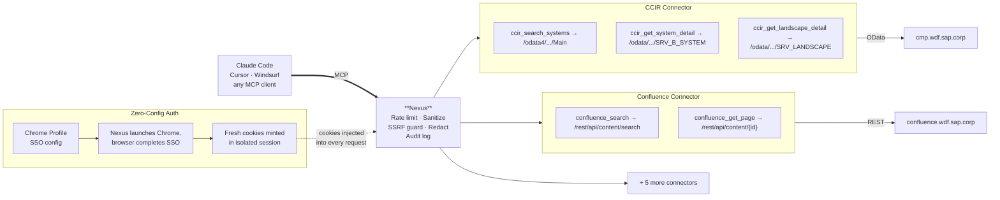

# Nexus MCP Server

> **Note:** Nexus is a research prototype, not a production-ready product. Some features are in beta and may change. Users are responsible for evaluating security and compliance requirements in their own environment. Use at your own discretion.

Enterprise MCP server connecting AI tools to Jira, Confluence, SharePoint and more — via browser SSO.

## Table of Contents

- [What is Nexus?](#what-is-nexus)
- [Architecture](#architecture)
  - [Connectors](#connectors)
- [Security](#security)
- [Getting Started](#getting-started)
  - [Prerequisites](#prerequisites)
  - [1. Install](#1-install)
  - [2. Run the setup wizard](#2-run-the-setup-wizard)
  - [3. Verify](#3-verify)
  - [4. Connect to Claude Code](#4-connect-to-claude-code)
- [Configuration](#configuration)
- [CLI Reference](#cli-reference)
- [Troubleshooting](#troubleshooting)
- [Contributing](#contributing)
- [License](#license)

## What is Nexus?

Nexus is a [Model Context Protocol (MCP)](https://modelcontextprotocol.io) server that gives AI assistants like Claude Code, Cursor, and other MCP-compatible tools access to enterprise systems. It authenticates using your existing browser SSO sessions — no API keys or service accounts needed.

## Architecture



Each connector is self-contained and registers its own tools. The server loads only connectors listed in your config — adding a new system means creating a connector directory and one config line.

### Connectors

| Connector | Host | Protocol | Tools |
|-----------|------|----------|-------|
| **Jira** | `jira.tools.sap` | REST | 6 |
| **Confluence** | `confluence.wdf.sap.corp` | REST | 2 |
| **SharePoint** | `sap.sharepoint.com` | OData | 2 |
| **CCIR** | `cmp.wdf.sap.corp` | OData V2/V4 | 3 |
| **SAP for Me** | `me.sap.com` | Browser rendering | 2 |
| **Focused Run** | `iop.bss.net.sap` | OData | 2 |
| **Browser** | Allowed domains (configurable) | Playwright | 7 |

#### Jira

| Tool | Description |
|------|-------------|
| `jira_search` | Search issues by project, assignee, status, or free text |
| `jira_get_issue` | Get full issue details by key |
| `jira_create_issue` | Create a new issue (story, bug, task, epic) |
| `jira_update_issue` | Update fields or transition status |
| `jira_add_comment` | Add a comment to an issue |
| `jira_list_watched_issues` | List issues you are watching |

#### Confluence

| Tool | Description |
|------|-------------|
| `confluence_search` | Search pages by text, space, title, or label |
| `confluence_get_page` | Get page content by ID or URL |

#### SharePoint

| Tool | Description |
|------|-------------|
| `sharepoint_search` | Search content by keywords with filters for type, file extension, and site |
| `sharepoint_list_pages` | List pages in a site ordered by last modified |

#### CCIR

| Tool | Description |
|------|-------------|
| `ccir_search_systems` | Search the Central System Information Registry by name, SID, or alias |
| `ccir_get_system_detail` | Get full system details: infrastructure, contacts, SLA, security classification, relations |
| `ccir_get_landscape_detail` | Get landscape identity and child systems |

#### SAP for Me

| Tool | Description |
|------|-------------|
| `sap_search_notes` | Search SAP Notes and KBAs |
| `sap_get_note` | Read the full content of an SAP Note |

#### Focused Run

| Tool | Description |
|------|-------------|
| `frun_search_csa` | Search CSA security compliance check results for a policy |
| `frun_get_csa_detail` | Get per-system findings for a specific CSA check |

#### Browser

Navigates within an allowlist of domains (default: `wiki.one.int.sap`, `sap.sharepoint.com`, `iop.bss.net.sap`, `grafana.aux-tooling.bss.net.sap`, `sapit-cloud.int.sap`). Configurable via `allowedDomains` in your config.

Opens a **visible browser window** by default (`headless: false`). Set `headless: true` in the connector config to disable the window (e.g. on headless CI).

| Tool | Description |
|------|-------------|
| `browser_navigate` | Navigate to a URL in an SSO-authenticated browser |
| `browser_snapshot` | Capture the accessibility tree of the current page |
| `browser_click` | Click an element by its ref from a snapshot |
| `browser_type` | Type text into an input field |
| `browser_press_key` | Press a keyboard key |
| `browser_back` | Go back to the previous page |
| `browser_close` | Close the browser session |

## Security

Every tool call passes through a security pipeline:
- **Rate limiting** — per-tool sliding window (configurable)
- **Input sanitization** — ANSI escapes, null bytes, Unicode homoglyphs normalized
- **Credential stripping** — secrets redacted from all error output
- **SSRF protection** — private IPs, cloud metadata endpoints blocked
- **Audit logging** — configurable level (`"all"`, `"errors"`, `"security"`, `"off"`) to `~/.nexus/audit.log`
- **File permissions** — `0o700` dirs, `0o600` files

## Getting Started

### Prerequisites

- **Node.js >= 20** — install via [nvm](https://github.com/nvm-sh/nvm) or [nodejs.org](https://nodejs.org)
- **Google Chrome** — must be installed at its default location for your platform
- You must have authorization to access the enterprise systems you want to connect (Jira, Confluence, SharePoint, etc.)

### 1. Install

Download the latest `.tgz` from the [Releases](../../releases) page, then install it globally:

```bash
npm install -g ./nexus-mcp-server-<version>.tgz
```

> **Browser download note:** Some browsers (especially Safari on macOS) automatically decompress `.tgz` files on download, leaving a `.tar` file instead. If this happens, just install the `.tar` file directly:
> ```bash
> npm install -g ./nexus-mcp-server-<version>.tar
> ```

Verify the install:

```bash
nexus --version
```

### 2. Run the setup wizard

```bash
nexus setup
```

The interactive wizard will:
- Ask you to accept the usage consent (required — the server will not start without it)
- Detect your Chrome profiles and let you choose one
- Ask which connectors to enable (connector URLs default to the standard SAP endpoints)
- Ask for the audit log level
- Write your config to `~/.nexus/config.yaml`

### 3. Verify

```bash
nexus status
nexus connectors check
```

`nexus status` shows your enabled connectors. `nexus connectors check` launches the browser, mints cookies, and makes a real authenticated request to each connector — verifying SSO authentication in one step.

### 4. Connect to Claude Code

Register Nexus as an MCP server using the `claude` CLI:

```bash
claude mcp add --scope user nexus -- nexus-mcp-server
```

To verify: `claude mcp list`

To remove later: `claude mcp remove nexus`

> **Other MCP clients**: The server command is `nexus-mcp-server` with stdio transport. Consult your client's docs for how to register MCP servers.

> **Note**: Nexus uses your existing Chrome sessions for authentication — no API keys or tokens are needed. You must have authorization to access the enterprise systems you want to connect.

## Configuration

### Nexus Config (`~/.nexus/config.yaml`)

```yaml
browser:
  chromeProfile: Default
  headless: true

security:
  auditLog: all

connectors:
  jira: {}
  confluence: {}
  sharepoint: {}
  ccir: {}
  sap-for-me: {}
  focused-run: {}
  browser:
    headless: false
```

**Enable/disable connectors** by adding or removing them from the `connectors` section. A connector not listed is not loaded — its tools won't appear.

The `browser.headless` global flag controls the cookie-minting browser (used by all connectors for SSO). The `browser` connector has its own `headless` setting (default `false`) that controls the automation window independently.

See [`config.example.yaml`](config.example.yaml) for a fully commented reference of every configuration option.

## CLI Reference

| Command | Description |
|---------|-------------|
| `nexus setup` | Interactive setup wizard (consent + config) |
| `nexus consent` | Review and accept the usage consent |
| `nexus status` | Show config, Chrome profile, connector summary |
| `nexus connectors` | Show all connectors with their tools and status |
| `nexus connectors enable <id>` | Enable a connector |
| `nexus connectors disable <id>` | Disable a connector |
| `nexus connectors validate` | Validate connector configs |
| `nexus connectors check [<id>]` | Verify SSO authentication for connectors |
| `nexus tools` | Show all tools with enabled/disabled status |
| `nexus tools disable <tool...>` | Disable tools (or `--connector <id>` for all tools in a connector) |
| `nexus tools enable <tool...>` | Enable tools (or `--connector <id>` for all tools in a connector) |
| `nexus sessions` | Show active browser SSO sessions |
| `nexus sessions revoke <name>` | Revoke a specific session |
| `nexus sessions clear` | Remove all sessions |
| `nexus audit` | View audit log (`--limit <n>`, `--errors`, `--json`) |
| `nexus audit clear` | Delete all audit log files |
| `nexus stats` | View tool usage statistics |
| `nexus stats clear` | Reset all statistics |
| `nexus reset` | Remove all nexus data (`~/.nexus`) — factory reset |

## Troubleshooting

If you encounter persistent issues with authentication, corrupt config, or unexpected behavior, you can factory-reset all Nexus data:

```bash
nexus reset
```

This removes the entire `~/.nexus` directory — config, sessions, audit logs, statistics, and any legacy files. You will need to run `nexus setup` again afterward. Use `nexus reset -y` to skip the confirmation prompt.

## Contributing

See the [Development Guide](docs/development/adding-connectors.md) for how to add new connectors or tools.

## License

Apache 2.0 — see [LICENSE](LICENSE).
